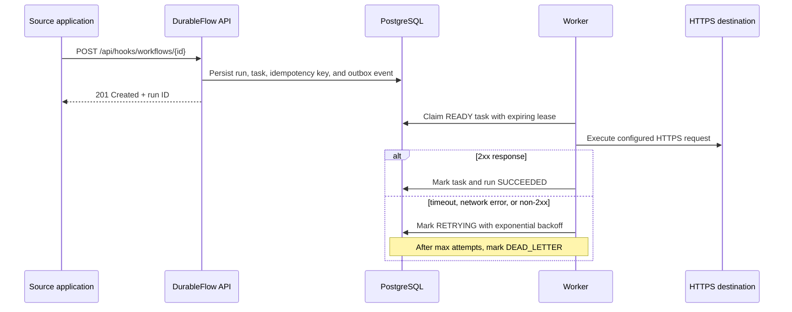

# DurableFlow

DurableFlow is a self-hosted webhook automation service. Connect a source application's webhook to an HTTPS endpoint, then inspect each delivery and automatic retry in one dashboard. Definitions and task state are persisted; work is coordinated through expiring leases, bounded retries, and recovery of abandoned tasks.

**Live deployment:** [http://13.50.190.190](http://13.50.190.190)

## What it does

This repository provides a real Spring Boot API and operations dashboard for creating webhook-to-HTTP automations and tracking their runs.

- Validates unique node identifiers.
- Rejects edges that point to nonexistent nodes.
- Rejects cyclic workflows using depth-first graph traversal.
- Persists immutable, versioned definitions in PostgreSQL through Flyway migrations.
- Exposes OpenAPI-ready JSON endpoints.
- Creates a persisted task for each node and marks only dependency-free nodes `READY`.
- Progresses dependent tasks to `READY` only after every predecessor succeeds.
- Requires idempotency keys for run creation and returns the existing run for a duplicate request.
- Uses expiring worker leases, heartbeats, exponential retry backoff, and dead-lettering for failed work.
- Uses a transactional outbox to publish task-ready events to Redis Streams after database state is committed.
- Executes configured `http` tasks against HTTPS endpoints; non-2xx responses enter the normal retry and dead-letter flow.
- Includes an opt-in worker that scans persisted ready tasks as a recovery-safe execution source; production handlers are registered explicitly by handler type.

## System design

```text
                         ┌──────────────────────────┐
Webhook source ────────► │  Spring Boot API          │ ◄──── React dashboard
Stripe / GitHub / app    │  • definition module      │       REST + WebSocket
                         │  • orchestration module   │
                         └────────────┬─────────────┘
                                      │ one database transaction
                         ┌────────────▼─────────────┐
                         │ PostgreSQL + Flyway       │
                         │ definitions · runs · tasks│
                         │ leases · retries · outbox │
                         └────────────┬─────────────┘
                                      ├─ committed task-ready event ─► Redis Streams
                                      │                                asynchronous dispatch transport
                                      │
                                      │ scan persisted READY tasks
                                      ▼
                         ┌──────────────────────────┐
                         │ Worker runtime            │
                         │ claim → execute → complete│
                         └────────────┬─────────────┘
                                      │ HTTPS
                                      ▼
                              Destination endpoint
```

Redis Streams is kept as the committed asynchronous dispatch transport. The worker's PostgreSQL scan is the recovery-safe execution path: every execution decision still comes from durable task state rather than a transient queue message.

The first release intentionally uses a modular monolith. A single deployable process makes transactions, debugging, and local development straightforward; its clear module boundaries allow the scheduler and worker runtime to split into services only if scale requires it.

### Delivery lifecycle



### Reliability model

| Concern | Mechanism | Result |
| --- | --- | --- |
| Duplicate source events | `(workflowDefinitionId, Idempotency-Key)` uniquely identifies a run | Repeated webhook posts return the original run instead of creating duplicate work. |
| API/database crash | Task state and its outbox record are committed together | A task is never marked ready without a durable dispatch record. |
| Worker crash mid-delivery | Worker lease expires after 30 seconds | Recovery moves abandoned work back into the retry flow. |
| Destination outage | Bounded exponential retry: 5s, 10s, then 20s | Transient failures retry automatically; exhausted tasks remain inspectable as `DEAD_LETTER`. |
| Redis interruption | Worker scans persisted `READY` tasks while the outbox continues to publish transport events | An unavailable or recreated stream consumer cannot permanently strand a delivery. |
| Invalid workflow | Graph validation rejects duplicate nodes, missing references, and cycles | Only executable DAGs are persisted. |

### Scaling path

The current deployment is deliberately optimized for a single server and simple operations. When workload requires it, the same boundaries support a gradual scale-out:

1. Run multiple API instances behind a load balancer; PostgreSQL remains the source of truth.
2. Run worker instances separately, each with its own worker ID and lease ownership.
3. Move PostgreSQL to a managed multi-AZ database and Redis to a managed cache.
4. Partition task polling/streams by tenant or workflow ID and add a queue consumer group per partition.

This is an evolution path, not a premature microservices design: task state, idempotency, and lease rules remain unchanged.

## Run locally

Prerequisites: Java 21, Maven 3.9+, Docker Desktop.

```bash
docker compose up --build
```

This starts PostgreSQL, Redis, the API + worker at `http://localhost:8080`, and the dashboard at `http://localhost:8081`. Use `noop` as a node handler type for the first end-to-end workflow; it is the intentionally deterministic demo handler. Stop the stack with `docker compose down`.

## Deploy on a single server

The production overlay keeps PostgreSQL, Redis, and the API on the internal Docker network and publishes only the dashboard on port 80. It also persists PostgreSQL data in a named volume.

```bash
cp .env.production.example .env.production
# Edit .env.production and replace both placeholder secrets with long random values.
docker compose --env-file .env.production -f docker-compose.yml -f docker-compose.prod.yml up --build -d
```

Use this setup behind HTTPS before sharing a public URL. WebSocket origins default to `*` because the dashboard uses no browser cookies or credentials; set `DURABLEFLOW_WEBSOCKET_ALLOWED_ORIGIN_PATTERNS=https://your-domain.example` when you introduce browser authentication. Manual task-control endpoints require `X-Operator-Token` and use a server-configured worker identity, never a caller-supplied `Worker-Id`. The production Compose overlay requires Docker Compose v2.24.4 or later because it uses the Compose `!reset` tag to remove local-only port mappings.

### Dashboard

```bash
cd frontend
pnpm install
pnpm dev
```

The Vite development server proxies `/api` to the Spring Boot service on port 8080. Create an automation in the dashboard, set its HTTPS destination, then copy the generated webhook URL into the source application. Use **Send sample event** to test the complete flow. The console subscribes to `/topic/runs/{runId}` over STOMP/WebSocket and updates after committed state transitions.

Create a definition, then start a run:

```bash
curl -X POST http://localhost:8080/api/workflows \
  -H "Content-Type: application/json" \
  -d '{
    "name": "order-fulfilment",
    "description": "Example dependency graph",
    "graph": {
      "nodes": [
        {"key": "validate", "handlerType": "noop"},
        {"key": "charge", "handlerType": "noop"},
        {"key": "receipt", "handlerType": "noop"}
      ],
      "edges": [
        {"from": "validate", "to": "charge"},
        {"from": "charge", "to": "receipt"}
      ]
    }
  }'
```

Copy the returned definition `id` into this request. The returned run `id` is the value to open in the dashboard.

```bash
curl -X POST http://localhost:8080/api/workflows/<definition-id>/runs \
  -H "Idempotency-Key: demo-order-001" \
  -H "Content-Type: application/json" \
  -d '{"orderId":"demo-001"}'
```

## API

| Method | Endpoint | Purpose |
| --- | --- | --- |
| `POST` | `/api/workflows` | Validate and store version 1 of a workflow definition |
| `GET` | `/api/workflows/{id}` | Read a stored definition |
| `POST` | `/api/workflows/validate` | Validate a graph without storing it |
| `POST` | `/api/workflows/{id}/runs` | Start a persisted workflow run |
| `POST` | `/api/runs/{runId}/tasks/{taskId}/claim` | Operator-only task claim; requires `X-Operator-Token` |
| `POST` | `/api/runs/{runId}/tasks/{taskId}/complete` | Operator-only task completion; requires `X-Operator-Token` |
| `POST` | `/api/runs/{runId}/tasks/{taskId}/heartbeat` | Operator-only lease extension; requires `X-Operator-Token` |
| `POST` | `/api/runs/{runId}/tasks/{taskId}/fail` | Operator-only retry/dead-letter action; requires `X-Operator-Token` |
| `GET` | `/api/runs/{runId}` | Read task states for one workflow run |
| `POST` | `/api/hooks/workflows/{workflowDefinitionId}` | Trigger a workflow from an external webhook |

### Webhook automation example

Create a definition with an `http` node whose `config` contains an HTTPS URL, method, and optional JSON body. Then any service can start the automation by posting an event payload to:

```bash
curl -X POST http://localhost:8080/api/hooks/workflows/<definition-id> \
  -H "Content-Type: application/json" \
  -H "Idempotency-Key: event-123" \
  -d '{"event":"invoice.paid","invoiceId":"inv-42"}'
```

## Verification

The deterministic unit suite covers DAG cycle validation and task state-machine transitions. A Testcontainers integration test covers persisted workflow execution when Docker Desktop is running:

```bash
cd backend
mvn test
```

The dashboard type-checks and builds as a production bundle:

```bash
cd frontend
pnpm build
```

## Operational boundaries

DurableFlow is an intentionally focused MVP. Manual task controls are token-gated, but webhook trigger endpoints remain open by design and do not yet verify source signatures. It accepts only `https://` destinations and uses JSON HTTP requests, but it does not yet include per-tenant isolation, rate limiting, or a secrets vault. Add those controls before exposing an instance to untrusted public traffic. For a portfolio deployment, put it behind HTTPS and restrict access to the dashboard/API with a reverse proxy or an identity-aware gateway.

## Design decisions

- **Transactional outbox:** a task is stored and its dispatch intent is written in the same database transaction; a scheduler publishes that intent to Redis Streams after commit. The worker also scans persisted ready tasks, so a transient stream-consumer outage cannot strand a delivery.
- **At-least-once workers:** workers must tolerate duplicate deliveries. The lease owner guards task transitions; abandoned leases become retries with exponential backoff and eventually dead-letter.
- **Idempotent starts:** a definition ID and idempotency key uniquely identify a run request, preventing accidental duplicate workflow instances.
- **Modular monolith:** workflow definition, orchestration, dispatch, worker runtime, and realtime modules are separable without premature distributed-system complexity.
